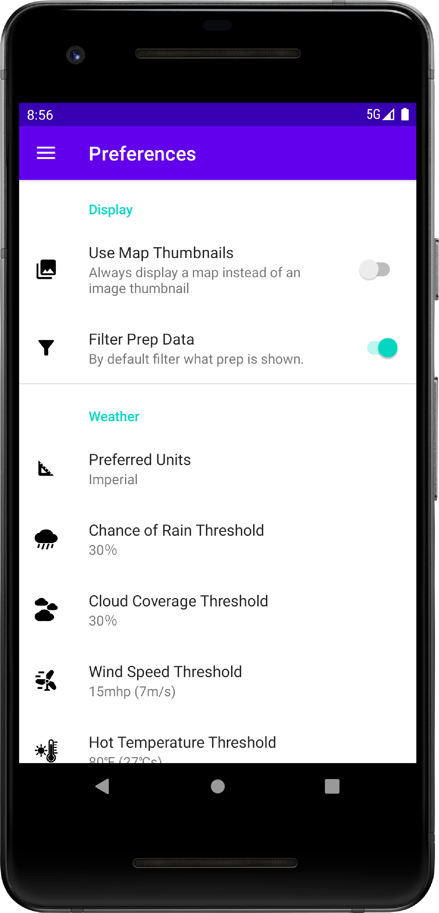

## Overview
Photo Prep is an Android app written in Kotlin. Photo Prep is a tool to help photographers prepare for photo shoots by enabling users to create dynamic checklists of prep items for their photo shoot locations. These checklists dynamically show prep based on the weather and subjects of the user's next photo shoot. The weather data is dynamically retrieved using the OpenWeather api.

The app has a screen to create or modify photo shoot locations. There is also a screen to list all the user’s photo shoot locations as well as a screen to view the details of each location which includes a checklist of prep. The common prep library screen enables the user to create prep that can then be copied to individual photo shoot locations. Additionally there is a preferences screen that allows the user to customize the ui and choose what values trigger the weather conditional prep. The app also has a custom dialog that is used to create and edit prep items. In order to optimize screen utilization for phones and tablets both in landscape and portrait orientation some screens have multiple versions.

This app is a capestone project for the [Android Kotlin Developer Nanodegree from Udacity](https://www.udacity.com/course/android-kotlin-developer-nanodegree--nd940) and can be found on the Google Play Store at https://play.google.com/store/apps/details?id=com.vcdaniel.photoprep

## Libraries and Techniques
* MVVM design pattern
* Material Design
* Google Maps SDK for Android
* OpenWeather One Call API
* AndroidX: Navigation, Constraint Layout, Preferences, Lifecycle LiveData, Room
* SquareUp: Picasso, Moshi, Retrofit
* Custom dialog utilizing a shared view model
* Supports import an existing image and taking a picture with the built in camera

## Installation
To get the project running on your local machine you need to add your OpenWeather and Google Maps api keys to the app build.gradle file.

To generate a key for the One Call API 3.0 from Open Weather follow the instructions at https://home.openweathermap.org/subscriptions/unauth_subscribe/onecall_30/base You will also need to generate a Google Maps api key. Instructions on how to do this can be found at:
https://developers.google.com/maps/documentation/places/android-sdk/get-api-key

Once you have generated these keys insert them into the corresponding resource value in the app build.gradle file. The resource values are named GOOGLE_API_KEY and WEATHER_API_KEY. For more information on Gradle resource values see https://developer.android.com/studio/build/gradle-tips.

## Screenshots

